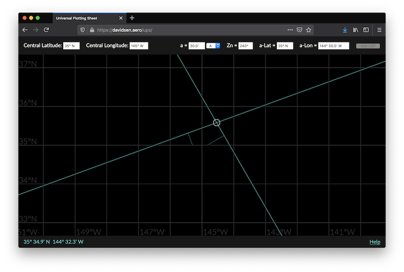

# Universal Plotting Sheet - simple web app for plotting lines of position from sight reductions

I threw this little app together on a lazy Saturday to help me in my celestial navigation studies. I mainly use it to double-check the work I do on paper plotting sheets.

## ...what?

Celestial navigation is the ancient technique of figuring out where you are by looking at stars, planets, the moon, and/or the sun (collectively, _celestial bodies_). By measuring how high in the sky a celestial body is, and noting the time of the measurement, a navigator can very accurately compute the geometric relationship between Earth, the celestial body, and the navigator. This computation is called a _sight reduction_. Once the navigator has the data from a sight reduction, they can use that information to draw a line on a map and confidently state, "I am somewhere on this line." Such a line is called a _line of position_ (LOP).

The app performs this drawing step.

LOPs can be plotted on all kinds of maps, but in the open ocean—where there is nothing to show on a map—navigators use something called a _universal plotting sheet_. This is a piece of paper with some handy geometry printed on it so that the sheet can be quickly set up to map any area on Earth. This app's display mimics a universal plotting sheet.

This app also identifies intersections between LOPs, and makes it easy to see their exact coordinates. With one LOP, a navigator knows that their position is on that line, but they don't know if it's at the beginning, the middle, or the end. How can they narrow down their position from "somewhere on this line" to "this exact spot?" The answer to this conundrum is another LOP. When a navigator has two (or more) LOPs, the lines will intersect, and the navigator can be confident that they're close to the intersection.

## Demo

To see it in action, go to [https://davidsen.aero/ups/](https://davidsen.aero/ups/).

Unfortunately, if you aren't already familiar with how to perform sight reductions, the app won't make much sense. But you can try it out by entering a sample navigation problem.

We are sailing from California to Hawaii. (Lucky us!) Our fancy GPS has done its best to withstand all the salt and moisture out here; alas, it has gone blank and simply won't turn back on. Fortunately you have a capable celestial navigator on board, and they brought their sextant and nautical almanac on this trip. Your navigator takes a couple sights with the sextant, does a bit of fiddling with some worksheets, and then gives you the following instructions:

1. At the top left are two text fields labeled "Central Latitude" and "Central Longitude." Enter `35 N` for the central latitude, and `145 W` for the central longitude.
2. Moving from there to the right, enter `20` into the "a" field.
3. Select `T` from the dropdown next to the "a" field.
4. Enter `340` in the "Zn" field.
5. Enter `35 N` into the "a-Lat" field.
6. Enter `145 18 W` into the "a-Lon" field.
7. Click "Add LOP."

You've just plotted a line of position; a green line appears on the map. There will also be a short, darker green line attached to your LOP. Don't worry about this short line for now; it's just a detail for record-keeping.

Your navigator continues:

1. Go back to the "a" field and enter `30`.
2. Choose `A` from the dropdown next to the "a" field.
3. Enter `240` into the "Zn" field.
4. Make sure the "a-Lat" field still says `35° N` from your first LOP.
5. Enter `144 50 W` into the "a-Lon" field.
6. Click "Add LOP."

A second line of position will appear (along with another short, dark green line that you can ignore), and the intersection of your two LOPs will be circled. Hover your mouse over this circle and you'll see the latitude and longitude at the bottom left—no GPS required.

## License

Copyright 2021 Dana L. Davidsen

Permission is hereby granted, free of charge, to any person obtaining a copy of this software and associated documentation files (the "Software"), to deal in the Software without restriction, including without limitation the rights to use, copy, modify, merge, publish, distribute, sublicense, and/or sell copies of the Software, and to permit persons to whom the Software is furnished to do so, subject to the following conditions:

The above copyright notice and this permission notice shall be included in all copies or substantial portions of the Software.

THE SOFTWARE IS PROVIDED "AS IS", WITHOUT WARRANTY OF ANY KIND, EXPRESS OR IMPLIED, INCLUDING BUT NOT LIMITED TO THE WARRANTIES OF MERCHANTABILITY, FITNESS FOR A PARTICULAR PURPOSE AND NONINFRINGEMENT. IN NO EVENT SHALL THE AUTHORS OR COPYRIGHT HOLDERS BE LIABLE FOR ANY CLAIM, DAMAGES OR OTHER LIABILITY, WHETHER IN AN ACTION OF CONTRACT, TORT OR OTHERWISE, ARISING FROM, OUT OF OR IN CONNECTION WITH THE SOFTWARE OR THE USE OR OTHER DEALINGS IN THE SOFTWARE.